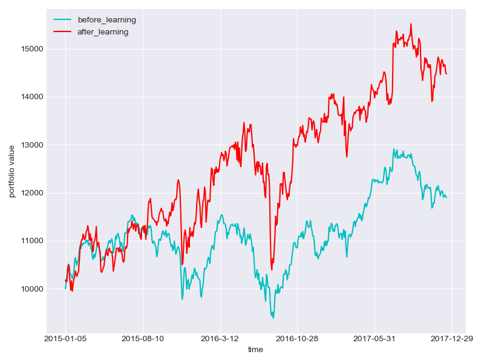
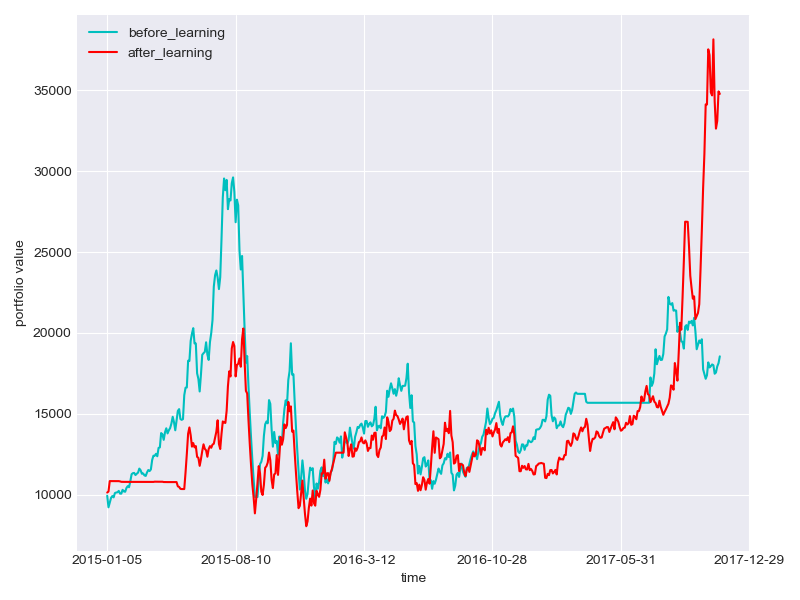
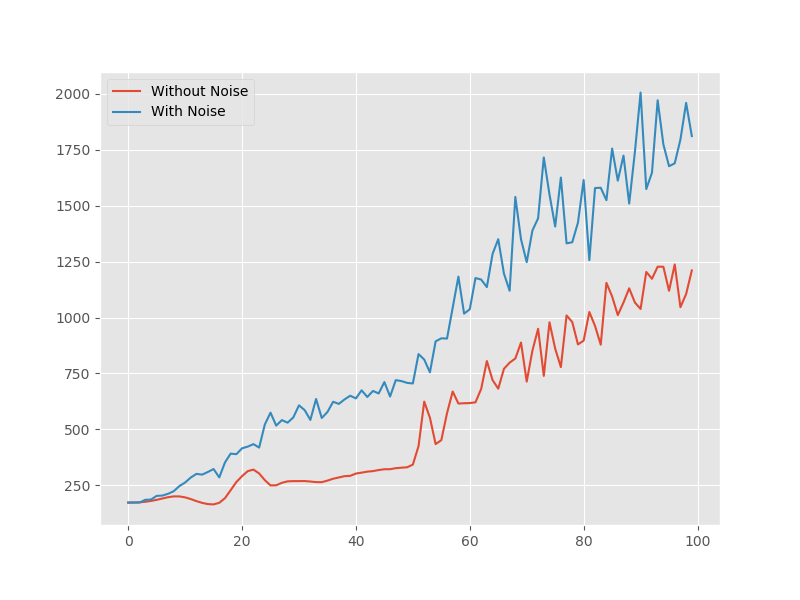
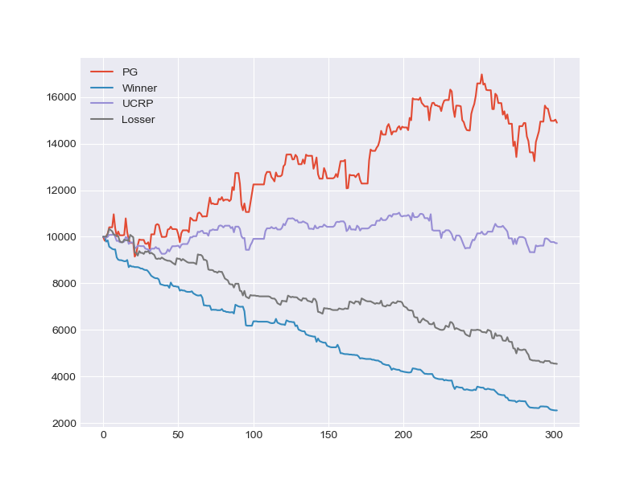
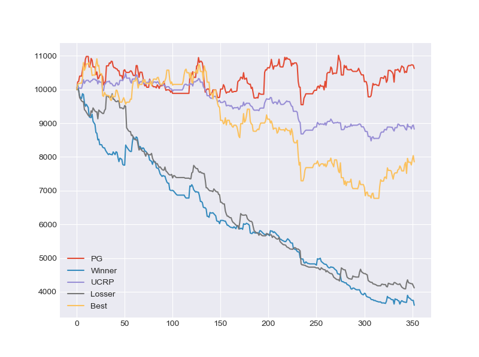
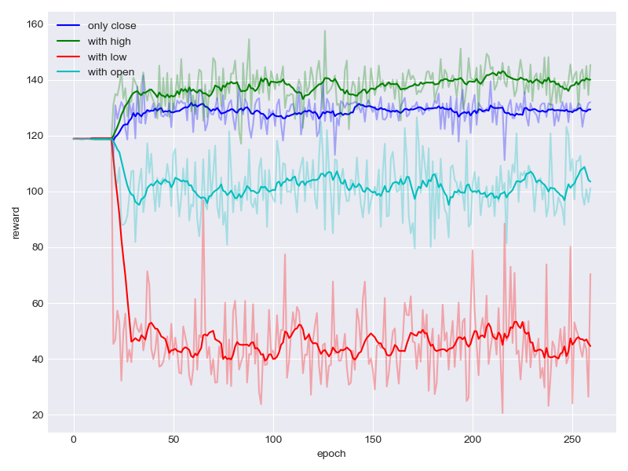

# Reinforcement Learning in Portfolio Management

## Introduction

This project implements three state-of-the-art continuous deep reinforcement learning algorithms, including Deep Deterministic Policy Gradient (DDPG), Proximal Policy Optimization (PPO), and Policy Gradient (PG), for portfolio management.

The project explores the performance of these algorithms under various settings, such as changes in learning rates, optimizers, network structures, stock market data, initializers, noise, and features, to assess their influence on the agents' performance (cumulative return).

## Using the Environment

The environment supports testing different reinforcement learning strategies for portfolio management.

### File Structure
- **main.py** - Entry point for running training and testing.
- **./saved_network/** - Directory containing saved models for DDPG and PPO.
- **./summary/** - Contains summary files for DDPG and PPO.
- **./agent/** - Contains `ddpg.py`, `ppo.py`, and `ornstein_uhlenbeck.py` (for adding noise to agent actions during training).
- **./data/** - Contains `America.csv` for USA stock data and `China.csv` for China stock data. The `download_data.py` script can download China stock data using Tushare. The `environment.py` file generates states for trading agents.
- **config.json** - Configuration file for training or testing settings.

Example of `config.json`:
```json
{
    "data":{
        "start_date":"2015-01-01",
        "end_date":"2018-01-01",
        "market_types":["stock"],
        "ktype":"D"
    },
    "session":{
        "start_date":"2015-01-05",
        "end_date":"2017-01-01",
        "market_types":"America",
        "codes":["AAPL","ADBE","BABA","SNE","V"],
        "features":["close"],
        "agents":["CNN","DDPG","3"],
        "epochs":"10000",
        "noise_flag":"False",
        "record_flag":"False",
        "plot_flag":"False",
        "reload_flag":"False",
        "trainable":"True",
        "method":"model_free"
    }
}
```

## Commands

### Download Stock Data
Download stock data for Shenzhen and Shanghai stock markets during the specified period (daily frequency):
```
python main.py --mode=download_data
```

### Training
Train reinforcement learning agents using the following command:
```
python main.py --mode=train
```

### Testing
Test the trained agents with the following command:
```
python main.py --mode=test
```

### Configurable Flags
- **noise_flag=True**: Adds Ornstein-Uhlenbeck noise to agent actions.
- **record_flag=True**: Stores trading details as a CSV file named by epoch and cumulative return.
- **plot_flag=True**: Plots the trend of wealth for each epoch.
- **reload_flag=True**: Reloads the latest saved model from `./saved_network/`.
- **trainable=True**: Updates parameters during each epoch.
- **method=model_based**: The agent initially follows a greedy strategy to quickly improve performance before shifting to model-free reinforcement learning.

## Results

### Training Data (USA)


### Training Data (China)


### Adversarial Training


### Backtest (China)



### APV Under Different Feature Combinations


More results and detailed analysis can be found in the project directory.

## Set Up

### Python Version
- **3.6**

### Required Modules
- **tensorflow** (or **tensorflow-gpu** for GPU support)
- **numpy**
- **pandas**
- **matplotlib**

## Contact
For any questions, please refer to the relevant project files or documentation.
